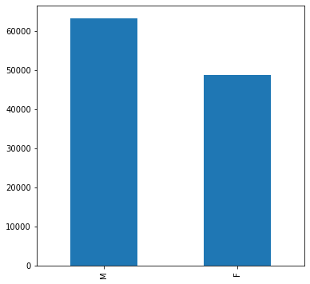

# FDA  Submission

**Your Name:** Paul

**Name of your Device:** Something-inator.

## Algorithm Description 

### 1. General Information

**Intended Use Statement:** 
The intended use of this device is to exam x-rays of the chest taken in either the AP or PA positions for indications of pneumonia in patients between the ages of 20 and 80.

**Indications for Use:**
Prioritization of xrays for radiologist review. It does not replace the radiologist, it only assists with prioritization. To assist in prioritization of examination For each image in the queue, submit to the model and prioritize those flagged as likely to indicate pneumonia for immediate review by a radiologist for confirmation so that the treatment may begin. Care should be taken to ensure that no x-ray is continually deprioritized and languishes unexamined.

**Device Limitations:**
The model does not flag all instances of pneumonia. Care should be take that no images ever bypass human examination. Additionally, the algorithm only works with x-rays taken of the chest in either the AP (anteriorposterior or PA (posterioranterior) positions. It is not suitable for other image types, body locations, or positions. 

**Clinical Impact of Performance:**

### 2. Algorithm Design and Function

**DICOM Checking Steps:**
* Verify image type is xray
* Verify body part is chest
* Verify body position is either AP or PA

**Preprocessing Steps:**

* Standardize the image use the VGG16 preprocessing function.

**CNN Architecture:**

Model: "vgg16"
_________________________________________________________________
Layer (type)                 Output Shape              Param #   
=================================================================
input_9 (InputLayer)         (None, 224, 224, 3)       0         
_________________________________________________________________
block1_conv1 (Conv2D)        (None, 224, 224, 64)      1792      
_________________________________________________________________
block1_conv2 (Conv2D)        (None, 224, 224, 64)      36928     
_________________________________________________________________
block1_pool (MaxPooling2D)   (None, 112, 112, 64)      0         
_________________________________________________________________
block2_conv1 (Conv2D)        (None, 112, 112, 128)     73856     
_________________________________________________________________
block2_conv2 (Conv2D)        (None, 112, 112, 128)     147584    
_________________________________________________________________
block2_pool (MaxPooling2D)   (None, 56, 56, 128)       0         
_________________________________________________________________
block3_conv1 (Conv2D)        (None, 56, 56, 256)       295168    
_________________________________________________________________
block3_conv2 (Conv2D)        (None, 56, 56, 256)       590080    
_________________________________________________________________
block3_conv3 (Conv2D)        (None, 56, 56, 256)       590080    
_________________________________________________________________
block3_pool (MaxPooling2D)   (None, 28, 28, 256)       0         
_________________________________________________________________
block4_conv1 (Conv2D)        (None, 28, 28, 512)       1180160   
_________________________________________________________________
block4_conv2 (Conv2D)        (None, 28, 28, 512)       2359808   
_________________________________________________________________
block4_conv3 (Conv2D)        (None, 28, 28, 512)       2359808   
_________________________________________________________________
block4_pool (MaxPooling2D)   (None, 14, 14, 512)       0         
_________________________________________________________________
block5_conv1 (Conv2D)        (None, 14, 14, 512)       2359808   
_________________________________________________________________
block5_conv2 (Conv2D)        (None, 14, 14, 512)       2359808   
_________________________________________________________________
block5_conv3 (Conv2D)        (None, 14, 14, 512)       2359808   
_________________________________________________________________
block5_pool (MaxPooling2D)   (None, 7, 7, 512)         0         

### 3. Algorithm Training

**Parameters:**
* Types of augmentation used during training

rescale=1. / 255.0
horizontal_flip  
height_shift_range= 0.1 
width_shift_range=0.1 
rotation_range=10 
shear_range = 0.1
zoom_range=0.1=

* Batch size
64

* Optimizer learning rate
0.001

* Layers of pre-existing architecture that were frozen
All layers from the VGG16 model were frozen.

* Layers of pre-existing architecture that were fine-tuned
The output layer was the only layer fine-tuned.

* Layers added to pre-existing architecture
The only additional layer add was the output or prediction layer.

**Final Threshold and Explanation:**

Given the goal of minimizing the the number of patients with pneumonia that the model predicts do not have pneumonia, instead of taking the threshold that maximizes the f-score, took the threshold of the second peak (0.46). Thus reducing the number of patients labeled without pneumonia that actually have pneumonia

### 4. Databases
 (For the below, include visualizations as they are useful and relevant)

**Description of Training Dataset:** 

2290 records selected from a record set with the following characteristics where 50% of the records represented those with pneumonia and 50% of the records represented those without pneumonia. 

**Description of Validation Dataset:** 

1430 records selected from a record set with the above characteristics where 20% of the records represented those with pneumonia and 80% of the records represented those without pneumonia.

### 5. Ground Truth

From https://www.kaggle.com/nih-chest-xrays/data ...

This NIH Chest X-ray Dataset is comprised of 112,120 X-ray images with disease labels from 30,805 unique patients. To create these labels, the authors used Natural Language Processing to text-mine disease classifications from the associated radiological reports. The labels are expected to be >90% accurate and suitable for weakly-supervised learning. The original radiology reports are not publicly available but you can find more details on the labeling process in this Open Access paper: "ChestX-ray8: Hospital-scale Chest X-ray Database and Benchmarks on Weakly-Supervised Classification and Localization of Common Thorax Diseases." (Wang et al.)

Link to paper https://www.nih.gov/news-events/news-releases/nih-clinical-center-provides-one-largest-publicly-available-chest-x-ray-datasets-scientific-community

### 6. FDA Validation Plan

**Patient Population Description for FDA Validation Dataset:**

Validation plan should include the comparison of the model results versus radiologists for chest xrays when the body is either in the PA or AP position. 

**Ground Truth Acquisition Methodology:**

The ground truth acquisition methodology is as cited as cited [here](https://arxiv.org/pdf/1711.05225.pdf). Four radiologists are selected for comparison purposes. The expectation is that the model will outperform the average of the radiologists.

**Algorithm Performance Standard:**

F1 score from our model was 0.433 and as cited [here](https://arxiv.org/pdf/1711.05225.pdf), the radiologist score was 0.387.
